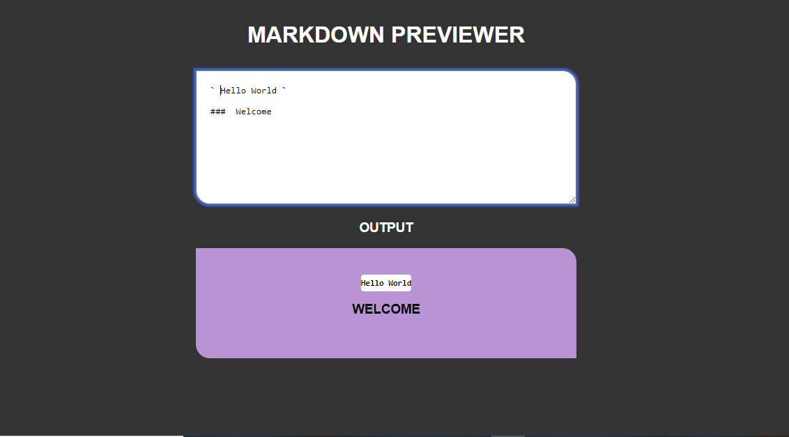

# Getting Started with Create React App

This project was bootstrapped with [Create React App](https://github.com/facebook/create-react-app).

# Free code Camp - Markdown Previewer solution

This is a solution to the [Markdown Previewer challenge on Free Code Camp]

## Table of contents

- [Overview](#overview)
  - [The challenge](#the-challenge)
  - [Screenshot](#screenshot)
  - [Links](#links)
- [My process](#my-process)
  - [Built with](#built-with)
  - [Useful resources](#useful-resources)
- [Author](#author)

## Overview

### The challenge

Users should be able to:

### Screenshot

### Links

- Solution URL: [https://github.com/PrincessMaggy/markdown-previewer.git]
- Live Site URL: [https://princessmaggy.github.io/markdown-previewer/]

## My process
- I set up react using node js.
- I hosted the app using gh pages.
- I installed sass using node js.
- I created components.
- I added marked cdn link; it's a low-level markdown compiler for parsing markdown language. 

### Built with

- Semantic HTML5 markup
- Sass
- React

## Useful Resources
[]
## Author

- Website - [PrincessMaggy](https://princessmaggy.github.io/My-Portfolio/)
- Twitter - [@princessmaggy7](https://www.twitter.com/princessmaggy7)
